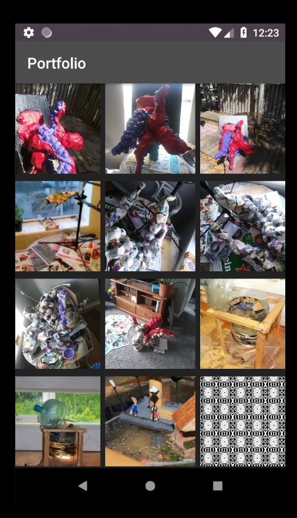

##  Kotlin Android GridView 

The simplest of Kotlin Gridview with a basic adapter.  Further improvements will include a recycler view and an onClick for viewing individual art projects.  What I've learned?  Careful what you find on the internet.  There's a lot of junk out there and sticking to the API will give you the cleanest solution in the long run. 

Used a secondary layout for inflation of an item.  Stylings composed in xml documents.

